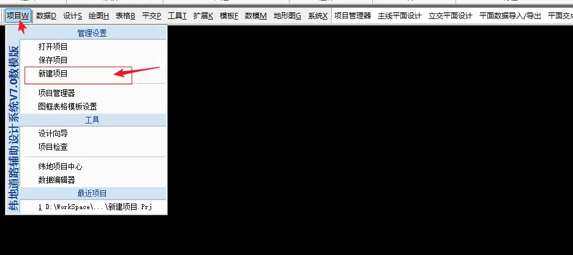
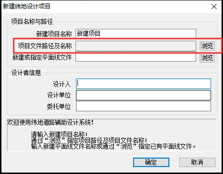
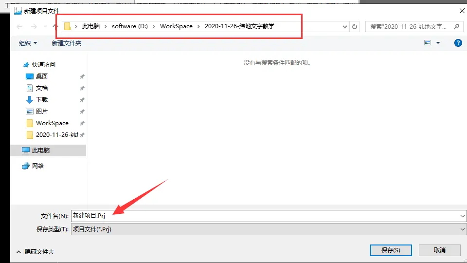
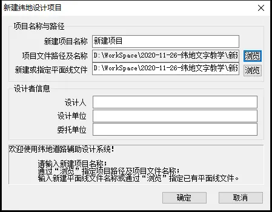
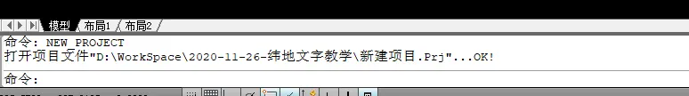

# 1.新建项目

> 这里，如果是已经做过设计，然后关闭了电脑，现在想重新做，那么就是**打开项目**，而**不是新建**了。
>
> **所有的操作都是基于项目来操作的，所有的数据都是基于项目文件之上的。**

## 纬地操作步骤

点击项目-新建项目

然后弹出这个窗口，这里我们**只需要做一件事**，就是**设置项目文件路径及名称**，点击旁边的浏览，

然后弹出下面这个窗口，命名或不命名都无所谓，重点是**你要找得到这个文件放在哪了**

然后就又重新回到以下窗口，`项目文件路径及名称`和`新建或指定平面线文件`自动填写好了。

这里还有一个设计者信息，到底要不要填。这里填也好，不填也无所谓，为什么？**因为这个信息是后面出图的时候才需要填写的**。这里相当于一个标签，如果你填写了，那么后面出图的时候，纬地会自动检索看看你这里写了什么信息，然后自动帮你填写上去，这个对整个过程的设计没有丝毫影响。

`就好比你买了个新本子会先写上自己的姓名，然后再写作业，或是先写完作业，然后再写上自己的名字是一个道理。`

我这里就不写名字了，**直接点击确定**，然后就可以在地下的命令栏看到提示：

这个就是新建项目的整个过程了。

## 注意事项

> 关于项目，需要注意一点就是，当你想退出软件的时候，必须**点击保存项目**，不然你之前的设计就都白费了。
