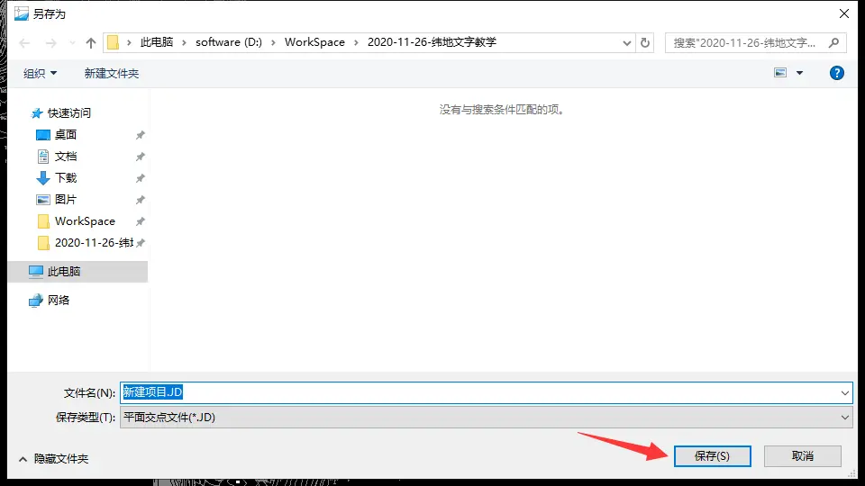
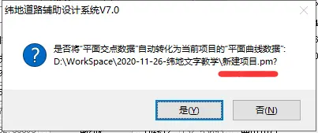

# 3. 平面选线

## 3.1 选交点

- **点击设计，主线平面设计**

然后弹出主线平面设计的窗口。

- **选一个地形图上的点，作为路线的起点**

我们先说怎么在软件上操作，然后再说需要考虑什么。

- 点击拾取，然后`鼠标移动`到你想作为起点的地方，`单击鼠标左键`就可以完成起点的选取。

这时候我们可以观察到，窗口上的 X、Y 坐标已经变了，之前是(0，0)，现在已经自动生成了一个新坐标。这个点就是你刚才选定的起点。

你可以看看上图，我们未拾取的时候，坐标都是（0,0），选取之后，纬地自动读取。

然后，点击`插入`：

弹出，是否插入`交点1`，点击`是`：

这时候，我们就回到了地形图上，不过鼠标在拉动一条线，即可以选线了。如下图，我随便选了一条。

这个时候，**我们只能选做直线，没有园曲线、缓和曲线，转弯都是折线**

最终，你选完了，就需要按键盘上的`回车键`（即 Enter 键），不然它是永远不会自动结束的。

当我按下`回车键`之后，就**自动重新弹回主线平面设计**的窗口(如果没有自动弹出，或者你关闭了，那么重新点击`设计`-`主线平面设计`，即可)：

如上图，可以按`向左`或者`向右`的箭头，查看这条路线的交点，也就是转弯的地方的点。

> 不过现在，转弯的地方都是折线转弯，如果这样设计的话，我估计没有人敢开车上路。所以你需要设计`园曲线`、`缓和曲线`。

那么如何设计`园曲线`，`缓和曲线`呢？这就需要在这个`交点`（也就是转折点）的地方做文章，由图中，我们可以看到，

这个窗口大概可以分成这样三部分：显示**交点数据**的区域、显示**园曲线及缓和曲线设计**的区域、显示**相关数据**的区域；

交点数据刚才我们用来选起点；数据显示区域就只是一个展示台；剩下的区域就是**做园曲线和缓和曲线设计的**部分了。

那如何做？就**按规范填入一些数据即可**。

> 注意，这里说填入，实际上就是你**对这条路线设计的考虑**，你觉得设计园曲线 300m 的半径，还是 1200m 的半径，这些需要你考虑填入。而具体该怎么考虑，那就需要结合规范来考虑了。

这里先随便填一下，稍后我们详细说这些参数怎么考虑（详见 3.3 选线思路）。

这里选用的计算模式是：`常规已知S1+Rc+S2`，然后需要`填写3个数据`，然后点击`试算`。

园曲线半径(Rc)：400

前缓和曲线(S1)：75

后缓和曲线(S2)：75

> 这里先讲一个小原则，当然后面也会详细讲到
>
> 即：S1：Sc：S2=1：1：1~1：2：1，就是说这三个的比值需要保持在这个范围。

我们填完之后，点击试算，园曲线长度 Sc 会自动计算出来，这三个数据 S1、Sc、S2 的比值要在 1：1：1~到 1：2：1 之间即可。

至此，平面设计的步骤就已经做完了，我们需要**保存刚才的路线文件**。

`点击`另存`或者`存盘`都可以，因为是第一次保存，无论点击哪一个，都会问你保存到哪。`

我们点击`存盘`。

弹出窗口，点击保存即可,然后弹出窗口：

`是否将“平面交点数据”自动转化为当前项目的“平曲线数据”？`

点击`是`,然后我们再点击一次`存盘`，然后弹出窗口提示文件保存结束，即可。

不放心还可以再点击一次保存......

最后，还要`保存项目`。点击`项目`-`保存项目`。这个就是在软件上做平面设计的完整流程。

## 3.2 平曲线参数设置

### 选线思路

如果你看懂了上面的操作流程，那么恭喜你，至少已经进步了很多了。

不过，光有操作是不行的，我们要做的是设计，不是走流程。那么接下来的小节中，我们要

那么在选线的时候需要注意哪些问题呢？这里 UP 也只能根据一些浅薄的理论知识来给大家讲解一些，我按我的方式来将，你看着吸收，如果有讲得不对或者不完整的地方，请多多指正。

- 最好能多省钱。

别哪有村子往哪挖，哪有天然气管道，我非要跨过去这样的，能少造桥就少造桥......先不说人家施工方在施工的时候难度有多大，就是业主爸爸也没有那么多钱给你折腾。最好呢，你就真的只有一条路，连涵洞都不要的。

> 这里说到了一些工程相关的单位，大的来讲就有三方，一个是设计单位，一个是业主，一个是施工单位。业主看中了一块地盘，出钱找人修路，首先要找一个设计的，然后找一个干活的（施工单位）
>
> `为啥不只找一家，让它自己设计，也同时让它干活。大家自己做设计的时候都知道自己设计的东西有多烂，你让我去干活，去你的吧，鬼知道这个东西怎么施工，不会。`
>
> `会干活的，设计的时候就各种挖坑，在业主身上挖矿。`
>
> 所以需要两手互相制约，相互牵制。
>
> 这里还有第四方，监理方，就是监督设计的好好设计，监督干活的好好干活，大家和平相处，要讲江湖规矩，讲武德，以和为贵。
>
> **咳咳，以上讲述的是极端情况，不要当真。**

总的来说，就是你在初次选线的时候呢：

首先要尽量避开房屋、不要多次跨相同的一条河，这样能够少造桥。其次，与村庄尽量避开，不能避开尽量少拆房子。然后，过山的时候呢，尽量少挖少填。感觉是一堆废话，不过也没办法，选线没有什么固定的套路，大家就自己多研究吧。这样就大概满足了省钱的原则。

- 要确保安全。

就是要符合规范，不然出问题了，在座的没有哪个可以脱得了干系。至于偷不偷工减料，那是人家施工单位的问题，不是你设计的问题。不过实际的施工难度，当然你也得考虑一下，别看到一个悬崖你非要说我就爱在这里搭桥，那是你觉得不能施工，我不要你觉得，我就觉得行......

那具体要怎么符合规范呢？一条路可以由直线部分、曲线部分、缓和曲线部分构成，那么规范就是要规定在不同等级、不同情况的条件之下，直线的最小长度、最大长度应该是多少；园曲线最小半径应该是多少，缓和曲线的最小长度应该是多少。

### 直线的要求

我们现在来翻翻这本《公路路线设计规范》JTG D20-2017——第七章 公路平面

**对直线的要求：**

> 首先，第一条，这条路直线部分长度不宜过长，因为直线太长了，在这条路上开车就会容易打瞌睡，容易翻车。
>
> 然后，第二条，这段直线也不能太短，不然开车的人刹不住车，容易引发车祸，翻车现场就是因为把油门当成刹车，一脚踩到底，路走窄了，最终不省人事。

### 园曲线最小半径

**对园曲线的要求：**

> 园曲线部分，也就是转弯的地方啦。
>
> 先说第一条，还记得开头我们选的那条路线吗？转弯的地方就是一个折线，你开车的时候，前面看着没啥子变化，油门一踩可能就冲下坡了，为了避免这种情况发生，就需要在这种转折的地方，设计一个曲线，让你提前知道，哦，要转弯了，准备打方向盘，这个曲线就是园曲线啦。
>
> **总之，第一条说的就是：转弯的地方，不能干巴巴的就一个折线，需要曲线来过渡**
>
> 然后第二条，既然**设计曲线，那么就需要精确的计算出来数据**，不能天天凭感觉，凭个人喜好。所以各位专家们已经计算出来了，我们看懂这个表格就好。
>
> 其实也挺容易看懂的，**根据`设计速度`、`超高设计值`来判断园曲线最小半径不能小于多少。**比如说，设计速度 80km/h，超高 6%，那么园曲线最小半径一般就不能小于 400m，如果你哪个地方条件实在苛刻，那么极限最小的半径不能小于 270m，再小就要出事了。
>
> 第三条，园曲线半径超过 1000m，那就和直线也没什么区别了，也就没有设计园曲线的必要了，这个地方也不要设置转弯了，就直接一条线拉到底即可。

关于园曲线最小半径，如果超过一定值，则园曲线可不设置超高，如下`表7.4.1不设超高的园曲线最小半径`所示，这一点，我们到后面讲关于超高加宽设置的时候再讲。

### 缓和曲线长度

**然后是缓和曲线的要求：**

> 因为公路平面缓和曲线采用的是回旋线，所以规范这里写的就是回旋线。
>
> 关于缓和曲线，首先要考虑的是，该不该设置？也就是要不要在纬地的软件上面，填写缓和曲线的长度。所以**规范说的就是考虑什么时候必须设置，什么时候不用设置。**
>
> 第一条，直线和园曲线相接的时候，要不要设置缓和曲线；
>
> 第二条，园曲线和园曲线相接的时候，要不要设置缓和曲线；大家都体验过连续转弯的情况吧？那就是两个转弯相接了。注意有**同向曲线相接和反向曲线相接**的情况？所以就需要你自己看自己路线的设计速度来判断，要不要设置缓和曲线。
>
> 第一条、第二条说的是**判断要不要设置**。不设置就无需多言，要是设置，该设置多少？
>
> 第三条，说的就是**该设置多少**的事情。还是看你的设计速度来判断的，比如你是 60km/h 的设计速度，然后是两个园曲线相接，那么根据第二条规范，肯定是要添加缓和曲线的啦。那么这个缓和曲线最小长度就不能小于 50m。你可以取 55m，60m，70m 等等以上。

现在我已经看完了规范，也按我浅薄的理解讲解完了，不知道你看了多少。

如果你看完了以上所说，那么你至少能大概知道这个地方的数据该填什么了。

> **对了，我之前还提到一个原则，即：S1：Sc：S2=1：1：1~1：2：1，就是说这三个的比值需要保持在这个范围。**
>
> 这个原则呢是，《道路勘测设计》第四版，第二章，讲平面设计的时候提到的，规范上并没有看到。不过也最好遵循。

现在我们回过头来看看《 公路路线设计规范》关于平面设计这部分的目录：

平面三要素：直线、园曲线、缓和曲线，都在这几个小结作出了详细的解释说明。

- **小结**

好了，最重要的差不多就这两个了，**省钱，能开车上路**，大家要求都低一点。

这里讲选线原则我经验过于浅薄，请大家转移到《道路勘测设计》第`(最新)`版,里面有详尽的公路选线、城市道路选线原则讲解，这里 UP 就不想再继续献丑了。或者你可以去查看文献，看看选线原则啊什么的，这个时候，看文献这种高逼格的动作，就在你身上体现出来了。或者多查查基本关于选线的书，多问问有经验的老师，师兄师姐（恩？有师姐吗？假设希望有吧）。本人知识止步于此了，继续扯下去就误人误己了，咳咳。

`话说回来，这一张好不容易有图片，结果图片里面还是文字，希望你们能静下心看。只要能看的书都看，多看几本。`

## 3.3 平面图例识别

其实选线原则这东西，一说谁都会，考虑的思路也比较明确，问题就是我不认识地形图上它标的到底是什么东西，说实话，不是我想挖这个房子，而是我根本不知道它是个房子！！所以，我觉得这个才是我能够帮助你的，现在开始识图模式。

- 房屋

既然那么怕拆房子，那我们先认识一下房子吧：

像这样用**矩形**来表示，然后中间写着砖、混之类的，就是房子了，砖就是用砖做的房子，砖 2，数字就一个编号，你知道这个是房子就行。这个可能不太清楚，再看一张：

看到那些**矩形**没？里面可能没写子，不过不影响它是房子，这么多矩形就说明这里有很多房子，也就是一个村落或者镇了。

这里有个总图，不过清晰度不是太高，不过勉强可以看到，就是各种房子。

- 农田、庄稼

第二个就是比较多的农田、庄稼了

看到这个向下的箭头没。这个就是稻田。还有就是像下面这种：

这个也是农田，不过是干旱的了，简称旱田。这种地方，如果当地是以此为生，那么修路的时候，最好就别穿过这里了，如果都出去打工了，那么人家巴不得你来占地，双手奉上。我就总图例奉上：

- 道路

还有道路

仔细看，还是很容易辨别的，它和等高线虽然有点像，不过却是独木成林，和等高线之间还是有一些**有角度的相交**，两条线就是道路两边的边界。而且**等高线是一条闭合的曲线**，虽然有些没有闭合，那是因为地形图被裁剪了，所以你看到是不闭合的。

公路相关的图例：

- 河流

河流的话;

和道路的差不多，也是用两条把两岸的边界标出来，不过河流还在中间用箭头把水流的方向标出来。

- 最后，看图层

如果你实在不知道你的地形图上标的是什么东西，可能是制作地形图的人使用了它自己的方式标记出来，还没来得及修正。不过一般都会写在图层上面的。比如说下面这个：

点击这条青色的线，标的居然是水系，可能是一条小溪，不配拥有正规图例吧。不过呢在图层的名字上已经写出来了，这个时候呢，这条小溪也只能忍着，吃了哑巴亏了。

- **小结**

我们认识了哪些常见的图例：房屋、道路、庄稼/农田、河流。其它的，比如电线杆什么的，大家多看看图层的名字。

## 3.4 平面相关文件解读

**1.为什么要保存项目呢？**

还记得第一节我们说了：**所有的数据都是基于项目文件之上的，**刚才我们存盘，是单独保存了这条**路线的数据文件**，这个时候项目文件会自动建立一个`索引`，意思就是说，`项目文件`帮我们自动寻找到了`平面路线文件`，这一点，可以打开项目管理器得到印证。

点击`项目`-`项目管理器`

然后弹出一下窗口：

可以看到平面交点文件，自动导入进来了，如果你不保存项目，那么下一次你就需要自己手动导入。我们可以选中平面交点文件那一行，然后旁边出现 3 个点，点击它。

然后就弹出一下窗口：

这个就是导入`.JD`文件时候弹出的窗口，点击保存，其实就是导入。

**2.关于项目文件`.Prj`和平面交点文件`.JD`**

我们现在可以回到文件夹下看现在生成了哪些文件：

第一个是`.Prj`文件；我们知道这个是项目文件，

第二个是`.JD`文件；这个是交点文件，也就是这条路线。

第三个是`.pm`文件；这个是什么东西？

还记得刚才存盘操作吗？存盘之后弹出了一个窗口

注意看后缀：`.pm`，这时候我们知道了，这个文件就是交点文件附带的一个东西，

就算丢失了，我们可以重新存盘一次，就自动生成了，不过前提是你得有`.JD`文件。这个`.pm`数据是后续纬地计算时需要用到的文件。

> 平面设计里面的文件最重要的其实就是`.JD`文件。里面包含了你设计的整条路线、每个交点的园曲线半径、缓和曲线长度。

> 项目文件里面保存的都是一些索引，并不是设计本身。

如果我要看你的**平面设计**，你只需要发给我一个`.JD`文件和地形图就可以了。然后我重新`新建`一个`新的项目`，导入`.JD`文件，存盘，生成`.pm`文件。这个时候，我电脑上的设计就和你的一模一样了。

现在大家是不是对这些交点文件有了一些更深的理解了？
