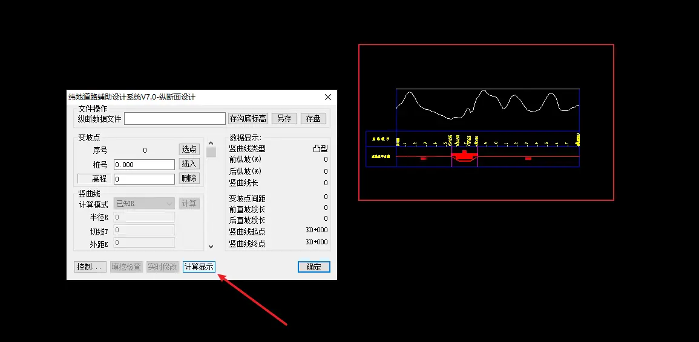
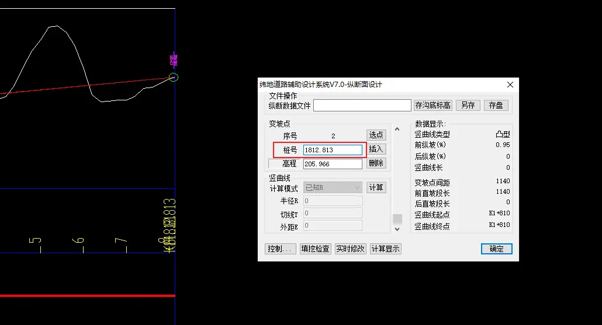

# 6. 做纵断面设计

### 衔接上一步操作

上一步如果你关闭软件，重新打开，仍然是点击项目-打开项目。然后就可以进行接下来的操作 了。

如果你直接做，记得**要删除地形模型**，或者**新建一个窗口**，才能进行接下来的操作。

点击设计-纵断面设计

然后点击计算显示，就会出现右侧的纵断面地面线图。

> 注意
>
> 这里很多同学显示不出来，是因为做完数模之后，这个窗口里面还有地形模型，然后多个图在同一个窗口，导致显示不出来，所以把地形模型删除，或者新建窗口进行操作。

### 变坡点

然后点击选点：

选择纵断面地面线的起点：

然后重新弹回窗口，点击插入：

这时候就可以进行拉坡操作了。

拉到终点的时候，可能会自动捕捉到终点前面的一点：

怎么也捕捉不到终点，这时候你先回车确定拉坡完成。然后重新弹出纵断面设计的窗口：

点击到最后一个变坡点，然后手动修改桩号为终点桩号，如果纵断面上的图看不清，可以点击纬地项目中心看看终点桩号：

点击项目-纬地项目中心：

点击桩号序列：

然后把终点桩号复制过去，这里终点桩号是 1812.813，所以最后一个变坡点填入 1812.813：

### 竖曲线半径

变坡点选取完成之后，接下来就要填入竖曲线半径：

这个就需要大家查询《公路路线设计规范》了。

填入半径之后，点击计算：

然后点击计算显示：

这时候在纵断面图上已标出竖曲线的位置，就说明纵断面设计完成了。

### 保存纵断面设计文件

接下来需要保存纵断面设计的数据，重新点击设计-纵断面设计，存盘：

弹出窗口，选择保存的位置：

点击保存，然后再存盘一次，提示保存完毕即可：

### 保存沟底标高文件

点击`存沟底标高`：

弹出窗口，选择左沟底标高，保存：

再次点击存沟底标高。选择右沟底标高，保存：

最后保存项目。
