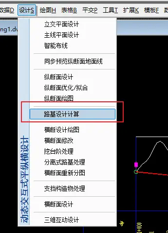
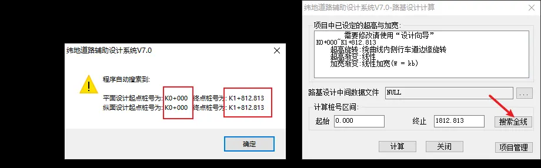
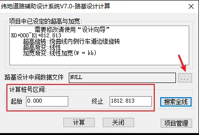
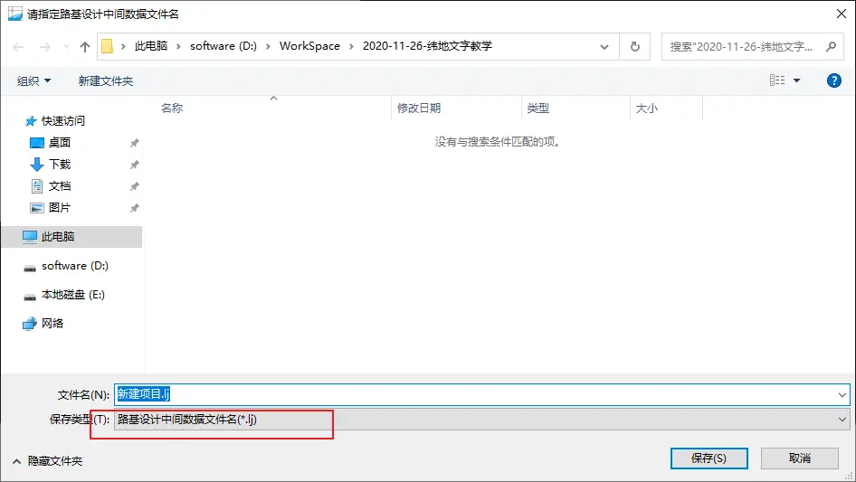
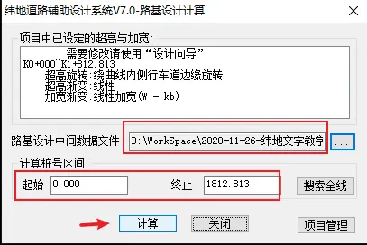
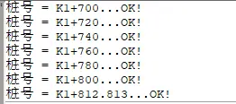

# 7 路基设计计算

### 衔接上一步操作

上一步如果你关闭软件，重新打开，仍然是点击项目-打开项目。然后就可以进行接下来的操作 了。

### 路基设计计算

点击设计，路基设计计算

弹出窗口，点击搜索全线：

然后弹出搜索结果提示，注意看平面设纵断面的起点、终点桩号是否一致，如果不一致，以平面的为主，去调整纵断面的桩号。

确保计算桩号区间都有之后，点击路基设计中间文件旁边的三个点，选择保存位置：

点击之后弹出保存提示：

点击保存即可。

确保计算桩号区间和路基设计中间文件都有值之后，点击计算：

然后看到命令栏提示：

所有桩号计算完成。

这时候保存一下项目，因为我们刚才保存了新的文件，所以项目文件就多了个索引，需要保存。
