# 9. 其它构造物的设计

关于其它构造物的设计，知识有限，无法详细说明，所以大家可以自行研究一下。

## 桥梁设计

> 这里的桥梁设计只能标注桥梁位置，无法设计桥梁细部构造。

虽然说路桥不分家，不过对于个人来说，这个路桥两部分的知识有点庞大，除非在路桥工作有些年限，否则仅凭书本这点内容，是没法掌握那么多的，笔者是道路与桥梁专业主修道路，故而桥梁部分的内容谈不上教学，只能给大家讲软件操作，输入填入的方法，至于设计桥梁，需要大家自己去查阅资料了。

下面是软件的操作：

点击数据-控制参数输入

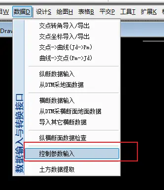

弹出窗口，选择桥梁：

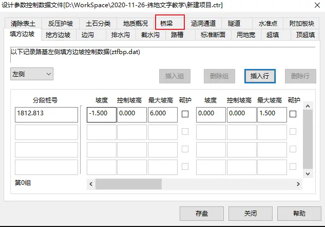

点击插入：

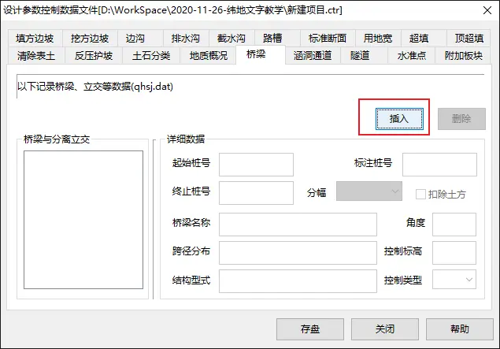

选中刚才新建的桥梁，输入起始桩号和各部分的桥梁名称：

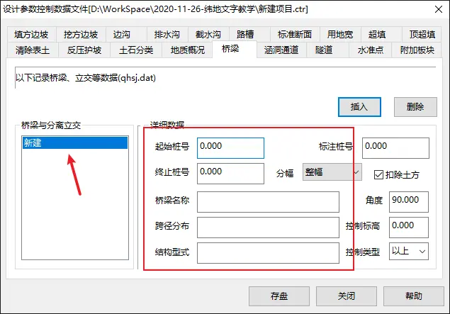

这里填写桥梁设计的位置，一般过河、农田、即其它地质不稳定的地方，都可以设计桥梁。

- 桥梁桩号

这里桥位的选择与地形图有关，而且这里也只是标注位置，就不一一详说。

- 桥梁名称

名称随便写一个，比如可以按功能、结构等来命名，比如从 XX 到 XX 桥、预应力混凝土 xxx 桥

- 跨径分布

“2\*25m”形式填入

前面的数字 2 表示跨数，即 2 跨

25m 代表单独一跨的长度，即每一跨有 25m。这座桥总长 50m。

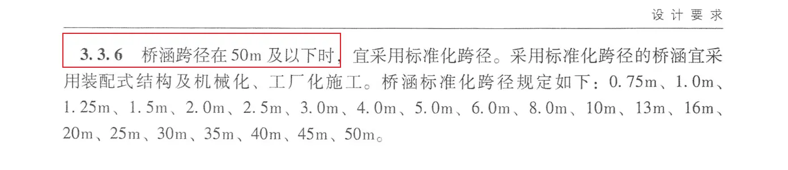

关于跨径的选择，请大家查询《公路桥涵设计通用规范》JTG D60-2015。

- 结构型式

板桥、梁桥、钢结构桥。

填写完成之后，点击存盘

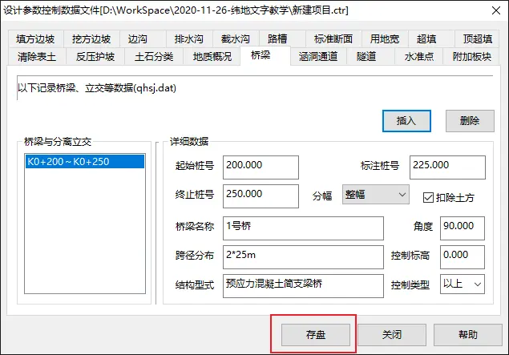

## 涵洞设计

同样在控制参数输入里进行，点击涵洞通道-插入：

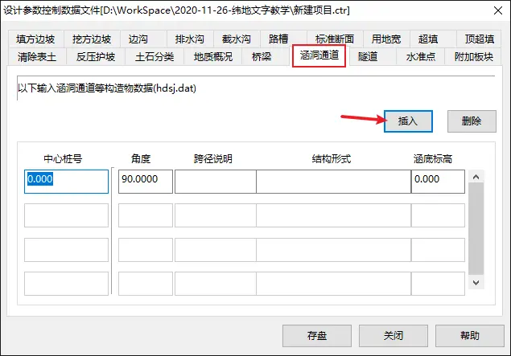

- 中心桩号

填写涵洞的中心桩号

- 角度

默认正交，即 90 度。

- 跨径说明

盖板涵:1-2.5×4m

1 跨，盖板涵界面尺寸。

圆管涵:1-Φ1.5m

1 跨，圆管涵界面半径。

- 结构型式

注释说明该跨径是哪种涵洞型式。下图来自《公路涵洞设计细则》JTGT D65-04-2007

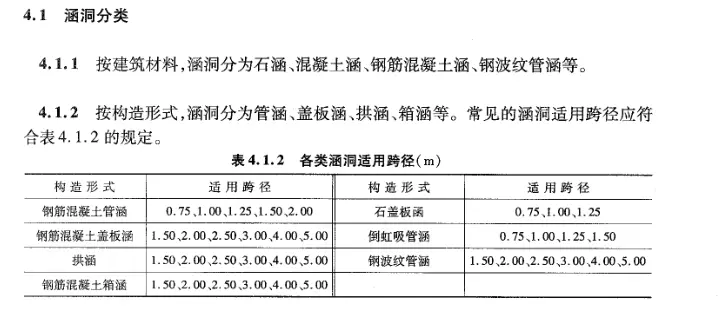

更多详细设计请自行查阅资料。

## 挡土墙

设计-支挡构造物处理

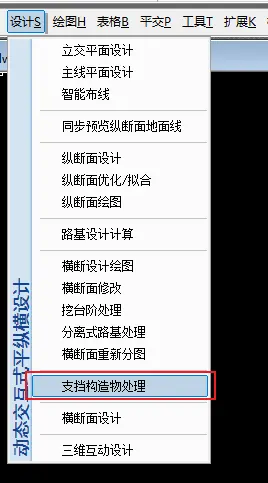

弹出挡墙设计工具：

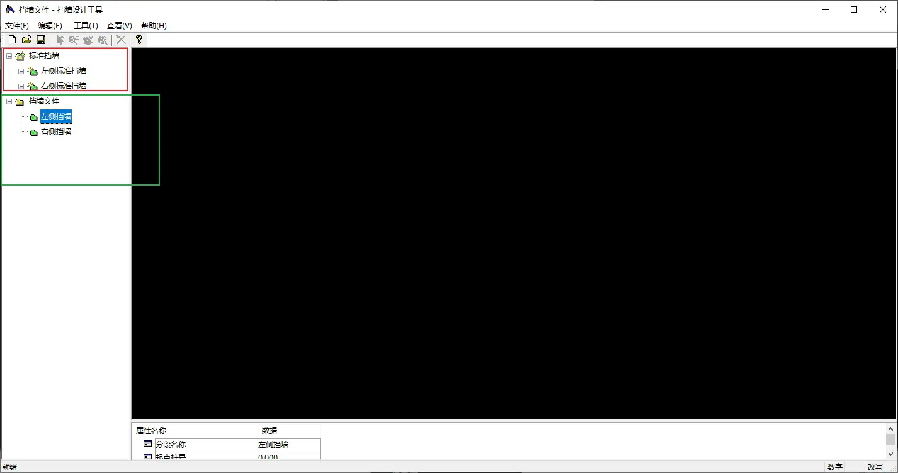

分为标准挡墙和挡墙文件

> 标准挡墙就是一个标准库，这里面都是画好的模型
>
> 挡墙文件是你设计的挡墙段。

首先要从挡墙库中拖拽一个标准图下来

> 从左侧挡墙库拖到左侧挡墙文件；
>
> 从右侧挡墙库拖到右侧挡墙文件。

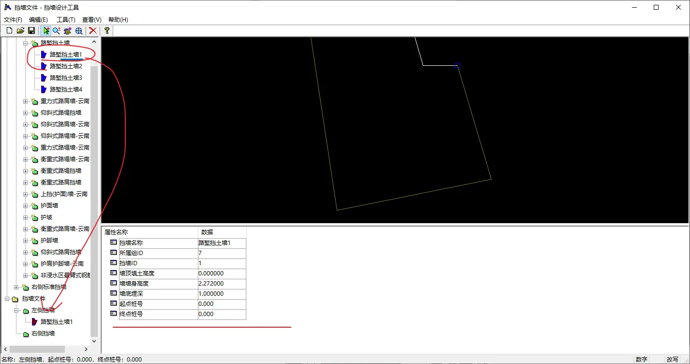

拖到挡墙文件之后，点击那个挡墙文件，设置起始桩号和相关的参数设置。

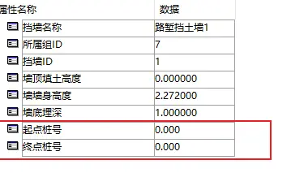

具体的设计请自己查阅资料。
